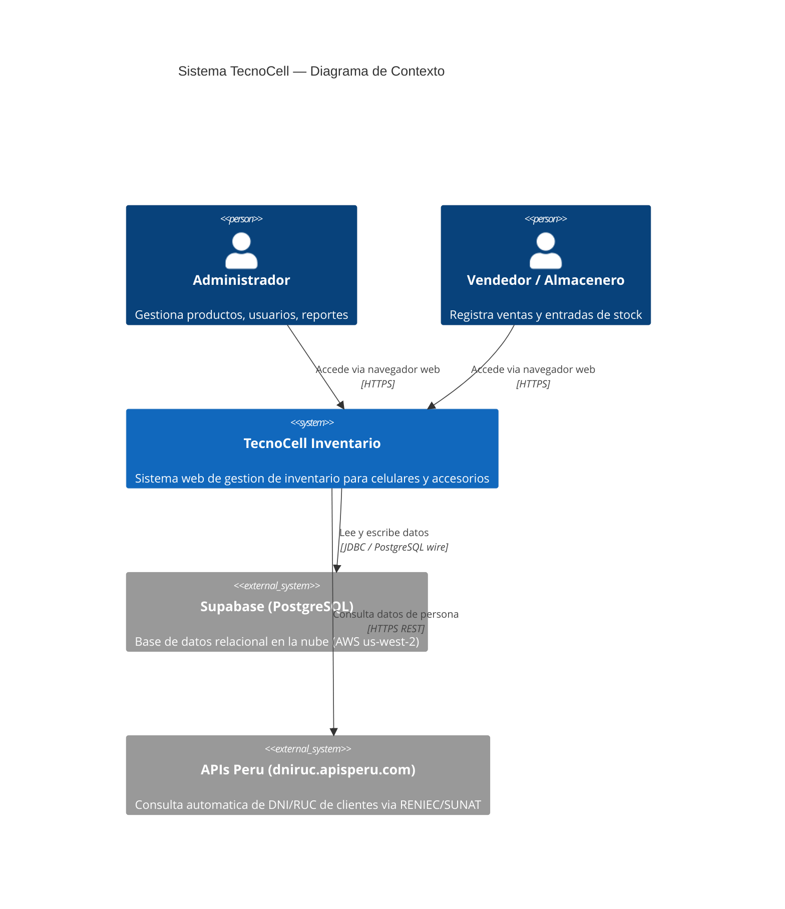
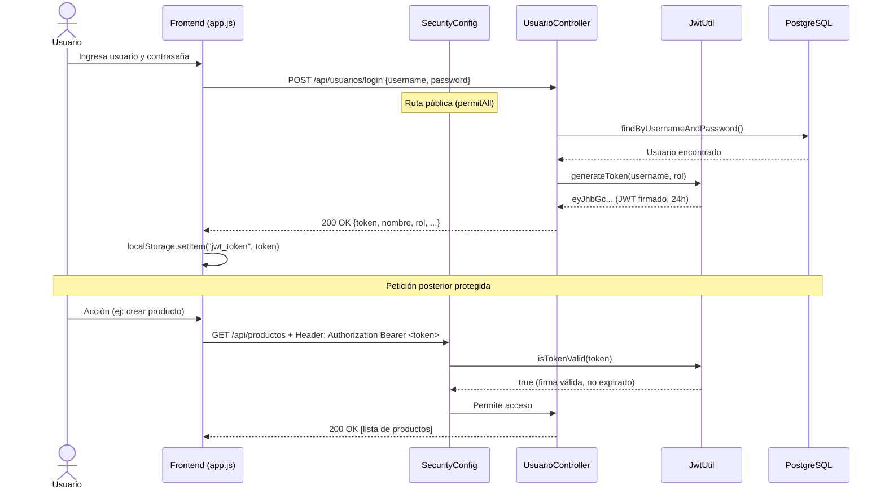
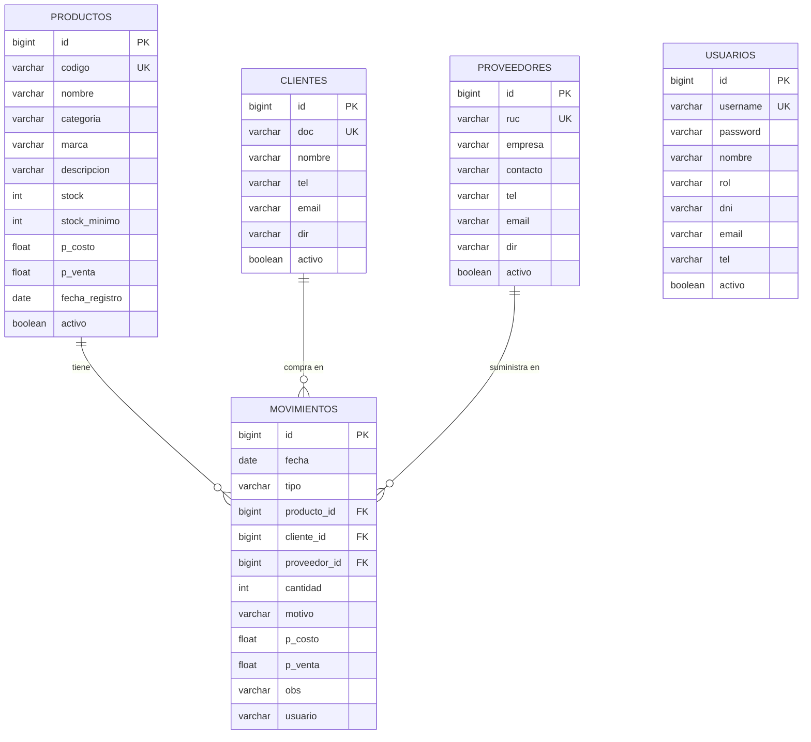

# Manual Técnico — TecnoCell Sistema de Inventario
**Versión:** 1.0.0 | **Fecha:** Julio 2026 | **Autor:** TecnoCell S.A.C.

---

## 1. Descripción General del Sistema

TecnoCell Inventario es un sistema web de gestión de inventario para una tienda de tecnología y celulares. Permite registrar productos, gestionar entradas y salidas de stock, administrar clientes/proveedores, controlar usuarios con roles y generar reportes. Está construido sobre una **arquitectura monolito modular** con backend Spring Boot y frontend HTML/JS puro, conectado a una base de datos PostgreSQL en la nube (Supabase).

---

## 2. Diagramas de Arquitectura C4

### 2.1 Nivel 1 — Diagrama de Contexto



### 2.2 Nivel 2 — Diagrama de Contenedores

```mermaid
C4Container
    title TecnoCell Inventario — Diagrama de Contenedores

    Person(user, "Usuario del Sistema", "Administrador, Vendedor o Almacenero")

    Container_Boundary(tc, "TecnoCell Inventario") {
        Container(frontend, "Frontend Web", "HTML5 + CSS3 + JavaScript (Vanilla)",
                  "Interfaz de usuario. Llama la API REST via fetch(). Almacena JWT en localStorage.")

        Container(backend, "Backend Spring Boot", "Java 21 + Spring Boot 4.0",
                  "API REST. Contiene toda la logica de negocio: autenticacion JWT, validacion, acceso a datos.")

        ContainerDb(db_local, "Supabase (Nube)", "PostgreSQL 15",
                    "Almacena productos, clientes, proveedores, usuarios y movimientos de inventario.")
    }

    System_Ext(apisPeru, "APIs Peru", "Consulta DNI / RUC")

    Rel(user,      frontend, "Usa", "Navegador / HTTP 8080")
    Rel(frontend,  backend,  "Llama endpoints REST", "HTTP + JWT Bearer Token")
    Rel(backend,   db_local, "Lee y escribe", "JDBC / HikariCP")
    Rel(frontend,  apisPeru, "Consulta DNI/RUC del cliente", "HTTPS")
```

### 2.3 Nivel 3 — Diagrama de Componentes (Backend)

```mermaid
C4Component
    title Backend Spring Boot — Diagrama de Componentes

    Container_Boundary(api, "Spring Boot Application") {

        Component(secFilter, "JwtFilter", "OncePerRequestFilter",
                  "Intercepta cada peticion HTTP. Valida el token JWT del header Authorization.")

        Component(secConfig, "SecurityConfig", "Spring Security Config",
                  "Define rutas publicas (login) y protegidas. Configura CORS y politica STATELESS.")

        Component(jwtUtil, "JwtUtil", "Spring Component",
                  "Genera, firma y valida tokens JWT. Extrae username y rol del token.")

        Component(ctrlProducto,    "ProductoController",    "REST Controller", "CRUD de productos")
        Component(ctrlCliente,     "ClienteController",     "REST Controller", "CRUD de clientes")
        Component(ctrlProveedor,   "ProveedorController",   "REST Controller", "CRUD de proveedores")
        Component(ctrlMovimiento,  "MovimientoController",  "REST Controller", "Registra entradas y salidas")
        Component(ctrlUsuario,     "UsuarioController",     "REST Controller", "CRUD de usuarios y login")

        Component(srvProducto,   "ProductoService",   "Spring Service", "Logica de negocio de productos")
        Component(srvCliente,    "ClienteService",    "Spring Service", "Logica de negocio de clientes")
        Component(srvProveedor,  "ProveedorService",  "Spring Service", "Logica de negocio de proveedores")
        Component(srvMovimiento, "MovimientoService", "Spring Service", "Registra movimiento y actualiza stock")
        Component(srvUsuario,    "UsuarioService",    "Spring Service", "Autenticacion y gestion de usuarios")

        Component(repoProducto,   "ProductoRepository",   "JPA Repository", "Acceso a tabla productos")
        Component(repoCliente,    "ClienteRepository",    "JPA Repository", "Acceso a tabla clientes")
        Component(repoProveedor,  "ProveedorRepository",  "JPA Repository", "Acceso a tabla proveedores")
        Component(repoMovimiento, "MovimientoRepository", "JPA Repository", "Acceso a tabla movimientos")
        Component(repoUsuario,    "UsuarioRepository",    "JPA Repository", "Acceso a tabla usuarios")
    }

    ContainerDb(db, "PostgreSQL (Supabase)", "", "Base de datos en la nube")

    Rel(secFilter, secConfig, "Delega configuracion de rutas")
    Rel(secFilter, jwtUtil,   "Valida token JWT")

    Rel(ctrlProducto,   srvProducto,   "Llama")
    Rel(ctrlCliente,    srvCliente,    "Llama")
    Rel(ctrlProveedor,  srvProveedor,  "Llama")
    Rel(ctrlMovimiento, srvMovimiento, "Llama")
    Rel(ctrlUsuario,    srvUsuario,    "Llama")
    Rel(ctrlUsuario,    jwtUtil,       "Genera token en login")

    Rel(srvProducto,   repoProducto,   "Usa")
    Rel(srvCliente,    repoCliente,    "Usa")
    Rel(srvProveedor,  repoProveedor,  "Usa")
    Rel(srvMovimiento, repoMovimiento, "Usa")
    Rel(srvUsuario,    repoUsuario,    "Usa")

    Rel(repoProducto,   db, "SQL")
    Rel(repoCliente,    db, "SQL")
    Rel(repoProveedor,  db, "SQL")
    Rel(repoMovimiento, db, "SQL")
    Rel(repoUsuario,    db, "SQL")
```

### 2.4 Diagrama de Flujo de Autenticación JWT



### 2.5 Modelo de Base de Datos (ERD)



---

## 3. Stack Tecnológico

| Capa | Tecnología | Versión |
|---|---|---|
| Lenguaje Backend | Java | 21 (LTS) |
| Framework Backend | Spring Boot | 4.0.7 |
| Seguridad | Spring Security + JJWT | 6.x / 0.12.6 |
| ORM | Hibernate / Spring Data JPA | 7.x |
| Base de Datos | PostgreSQL (vía Supabase) | 15 |
| Pool de Conexiones | HikariCP | (incluido en Spring Boot) |
| Frontend | HTML5 + CSS3 + JavaScript ES6+ | — |
| Contenedores | Docker + Docker Compose | 24+ / 2.x |
| Build | Maven | 3.9+ |
| IDE | IntelliJ IDEA | 2026.1 |

---

## 4. Endpoints REST de la API

Todos los endpoints (excepto `/api/usuarios/login`) requieren el header:
```
Authorization: Bearer <JWT_TOKEN>
```

### 4.1 Autenticación
| Método | Endpoint | Descripción | Auth |
|---|---|---|---|
| POST | `/api/usuarios/login` | Login. Devuelve token JWT | ❌ No |

**Request body:**
```json
{ "username": "admin", "password": "1234" }
```
**Response 200:**
```json
{
  "token": "eyJhbGciOiJIUzI1...",
  "id": 1,
  "username": "admin",
  "nombre": "Administrador",
  "rol": "Administrador"
}
```

### 4.2 Productos
| Método | Endpoint | Descripción |
|---|---|---|
| GET | `/api/productos` | Lista todos los productos activos |
| GET | `/api/productos/{id}` | Obtiene un producto por ID |
| POST | `/api/productos` | Crea un nuevo producto |
| PUT | `/api/productos/{id}` | Actualiza un producto |
| DELETE | `/api/productos/{id}` | Desactiva (borrado lógico) |

### 4.3 Movimientos
| Método | Endpoint | Descripción |
|---|---|---|
| GET | `/api/movimientos` | Lista todos los movimientos |
| POST | `/api/movimientos/entrada` | Registra entrada de stock |
| POST | `/api/movimientos/salida` | Registra salida/venta de stock |

**Ejemplo — Registrar Entrada:**
```json
{
  "tipo": "ENTRADA",
  "producto": { "id": 1 },
  "proveedor": { "id": 2 },
  "cantidad": 10,
  "pCosto": 450.00,
  "obs": "Compra factura F001-123",
  "usuario": "admin"
}
```

### 4.4 Clientes, Proveedores y Usuarios
Siguen el mismo patrón CRUD:
- `GET /api/{entidad}` — Listar
- `GET /api/{entidad}/{id}` — Obtener
- `POST /api/{entidad}` — Crear
- `PUT /api/{entidad}/{id}` — Actualizar
- `DELETE /api/{entidad}/{id}` — Eliminar (lógico)

---

## 5. Despliegue con Docker

### 5.1 Requisitos previos
- Docker Desktop instalado
- Conexión a internet (para conectar con Supabase)

### 5.2 Pasos para construir y ejecutar

```bash
# 1. Clonar el repositorio
git clone <url-del-repo>
cd Inventario

# 2. Crear archivo .env con credenciales (NO se sube al repo)
echo "DB_URL=jdbc:postgresql://aws-0-us-west-2.pooler.supabase.com:5432/postgres" > .env
echo "DB_USER=postgres.cilnbzovlcarnjkiuylh" >> .env
echo "DB_PASS=TuPasswordAqui" >> .env
echo "JWT_SECRET=MiClaveSecretaLarga2024" >> .env

# 3. Construir y levantar el contenedor
docker-compose up --build

# 4. Acceder a la aplicación
# Abrir navegador: http://localhost:8080
```

### 5.3 Verificar que el contenedor corre
```bash
docker ps
# CONTAINER ID   IMAGE                    STATUS         PORTS
# abc123...      tecnocell-inventario     Up 2 minutes   0.0.0.0:8080->8080/tcp
```

---

## 6. Configuración de Variables de Entorno

| Variable | Descripción | Ejemplo |
|---|---|---|
| `DB_URL` | URL JDBC de la base de datos | `jdbc:postgresql://host:5432/postgres` |
| `DB_USER` | Usuario de la base de datos | `postgres.cilnbzovlcarnjkiuylh` |
| `DB_PASS` | Contraseña de la base de datos | `*****` |
| `JWT_SECRET` | Clave para firmar los tokens JWT (mín. 32 caracteres) | `MiClaveSecretaLarga2024!` |

---

## 7. Estructura del Proyecto

```
Inventario/
├── src/
│   ├── main/
│   │   ├── java/com/tecnocell/Inventario/
│   │   │   ├── controller/          # Controladores REST
│   │   │   │   ├── ProductoController.java
│   │   │   │   ├── ClienteController.java
│   │   │   │   ├── ProveedorController.java
│   │   │   │   ├── MovimientoController.java
│   │   │   │   └── UsuarioController.java
│   │   │   ├── model/               # Entidades JPA
│   │   │   │   ├── Producto.java
│   │   │   │   ├── Cliente.java
│   │   │   │   ├── Proveedor.java
│   │   │   │   ├── Movimiento.java
│   │   │   │   └── Usuario.java
│   │   │   ├── repository/          # Repositorios JPA
│   │   │   ├── service/             # Lógica de negocio
│   │   │   ├── security/            # JWT + Spring Security
│   │   │   │   ├── JwtUtil.java
│   │   │   │   ├── JwtFilter.java
│   │   │   │   └── SecurityConfig.java
│   │   │   └── exception/           # Manejo global de errores
│   │   └── resources/
│   │       ├── application.properties
│   │       └── static/              # Frontend (HTML, CSS, JS)
│   └── test/                        # Pruebas funcionales
├── Dockerfile
├── docker-compose.yml
├── .gitignore
└── pom.xml
```
